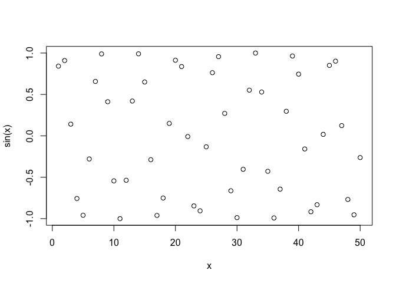
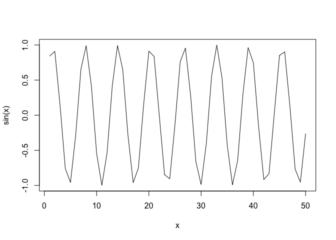
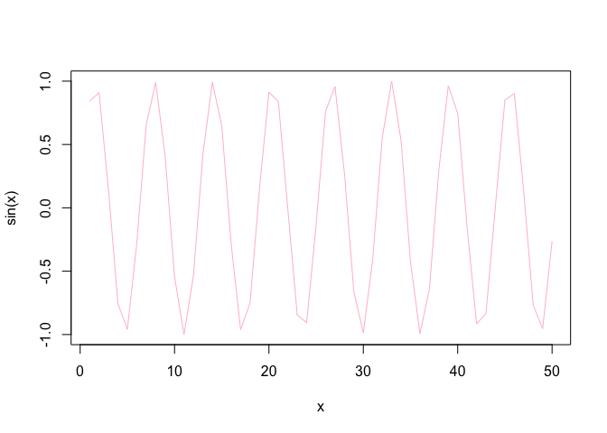
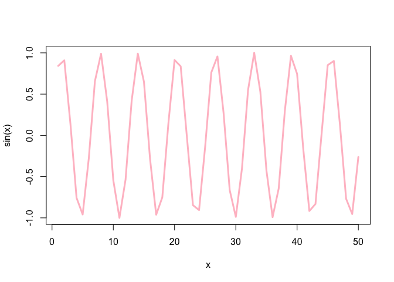
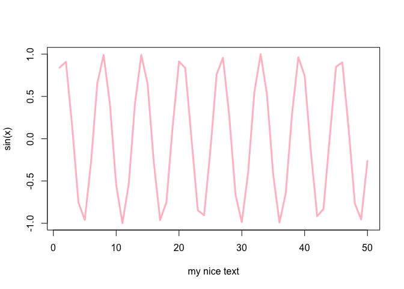

Introduction to R
================
andrea
2021-12-04

``` r
x <- 1:50
plot(x, sin(x))
```

<!-- -->

``` r
plot(x, sin(x), type=("l"))
```

<!-- -->

``` r
plot(x, sin(x), type=("l"), col=("pink"))
```

<!-- -->

``` r
plot(x, sin(x), type=("l"), col=("pink"), lwd=(3))
```

<!-- -->

``` r
plot(x, sin(x), type=("l"), col=("pink"), lwd=(3), xlab=("my nice text"))
```

<!-- -->
