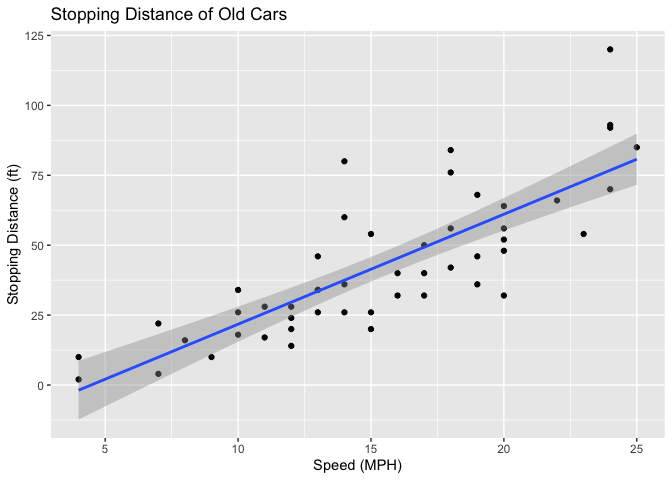
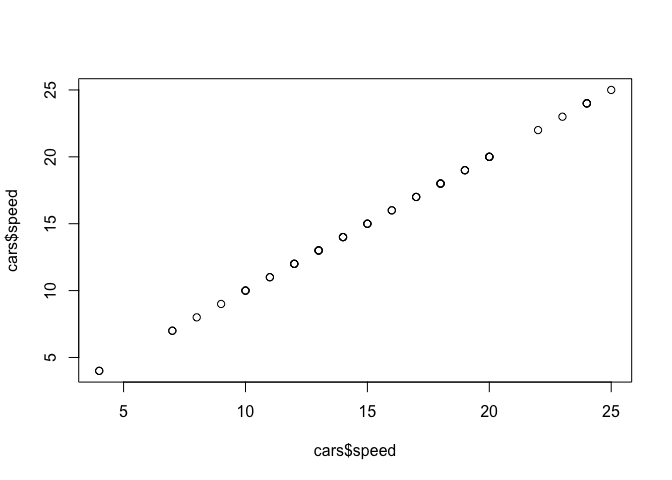
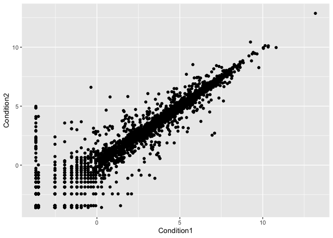
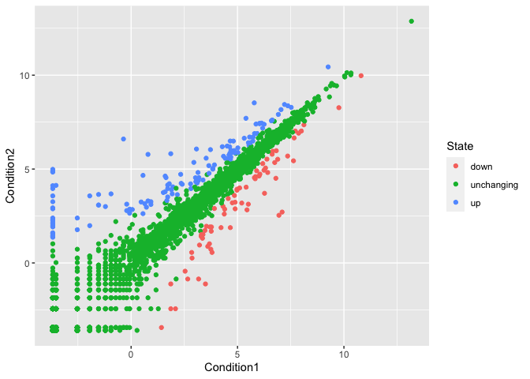
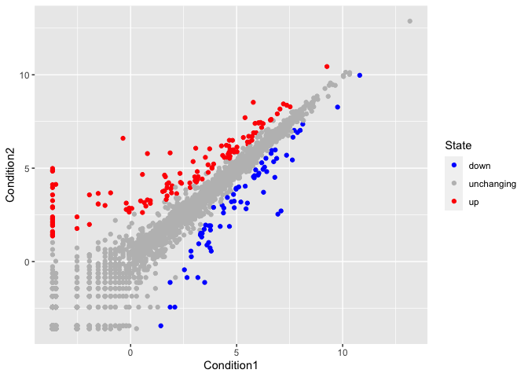
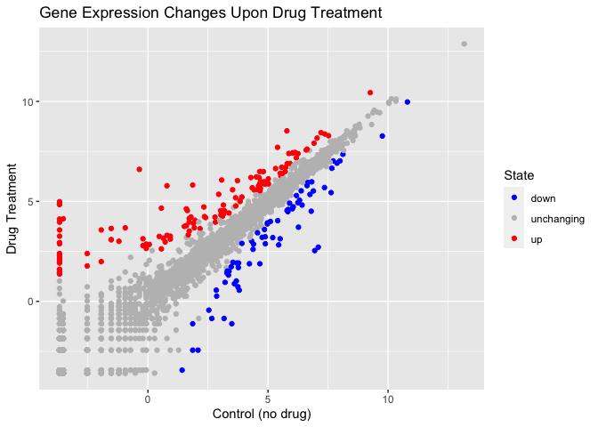
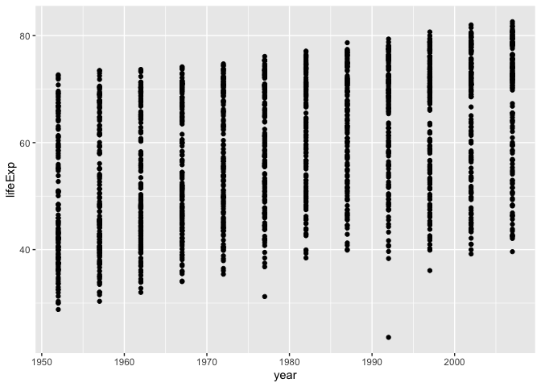
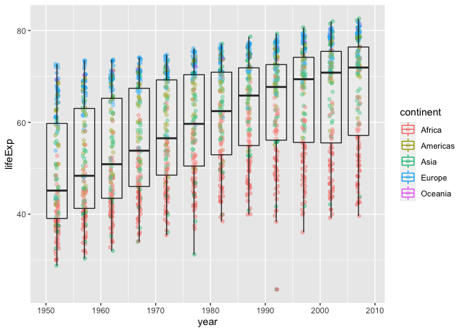
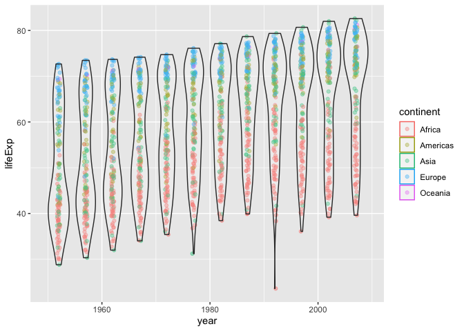

Data Visualization
================
andrea
2021-12-03

``` r
# Class 5: Data Visualization

#Today we are going to use ggplot2 package
#First we need to load the package!
library(ggplot2)

head(cars)
```

    ##   speed dist
    ## 1     4    2
    ## 2     4   10
    ## 3     7    4
    ## 4     7   22
    ## 5     8   16
    ## 6     9   10

``` r
#We will use this inbuilt "cars" dataset first
#All ggplots have at least 3 layers, 
# data + aes + geoms
ggplot(data=cars)+aes(x=speed, y=dist)+
  geom_point()+
  geom_smooth(method="lm")+
  labs(title="Stopping Distance of Old Cars",
       x="Speed (MPH)", y="Stopping Distance (ft)")
```

    ## `geom_smooth()` using formula 'y ~ x'

<!-- -->

``` r
#Sidenote: ggplot is not the only graphing system, but very popular and good 
#to use base R graphics

#easy quick way to visualize data essentially the first three stats of ggplot
plot(cars)
```

<!-- -->

``` r
plot(cars$speed, cars$speed)
```

<!-- -->

``` r
url <- "https://bioboot.github.io/bimm143_S20/class-material/up_down_expression.txt"

genes <- read.delim(url)
head(genes)
```

    ##         Gene Condition1 Condition2      State
    ## 1      A4GNT -3.6808610 -3.4401355 unchanging
    ## 2       AAAS  4.5479580  4.3864126 unchanging
    ## 3      AASDH  3.7190695  3.4787276 unchanging
    ## 4       AATF  5.0784720  5.0151916 unchanging
    ## 5       AATK  0.4711421  0.5598642 unchanging
    ## 6 AB015752.4 -3.6808610 -3.5921390 unchanging

``` r
nrow(genes)
```

    ## [1] 5196

``` r
colnames(genes)
```

    ## [1] "Gene"       "Condition1" "Condition2" "State"

``` r
ncol(genes)
```

    ## [1] 4

``` r
table(genes$State)
```

    ## 
    ##       down unchanging         up 
    ##         72       4997        127

``` r
#to find the percent up regulated genes:
127/5196
```

    ## [1] 0.02444188

``` r
#or
round(table(genes$State)/nrow(genes)*100, 3) 
```

    ## 
    ##       down unchanging         up 
    ##      1.386     96.170      2.444

``` r
#3 determines the number of significant figures, you can change based on what you want
#dont put quotation marks for the axes
ggplot(data=genes)+
  aes(x=Condition1, y=Condition2)+
  geom_point()
```

<!-- -->

``` r
#adding color
p<-ggplot(data=genes)+
  aes(x=Condition1, y=Condition2, col=State)+
  geom_point()
p
```

<!-- -->

``` r
#changing colors
p+scale_color_manual(values=c("blue","gray","red"))
```

<!-- -->

``` r
#add labels
p+scale_color_manual(values=c("blue","gray","red"))+
  labs(title="Gene Expression Changes Upon Drug Treatment",
         x="Control (no drug)",
       y="Drug Treatment")
```

<!-- -->

``` r
#Lets explore the gapminder dataset

#install.packages("gapminder")
library("gapminder")
head(gapminder)
```

    ## # A tibble: 6 × 6
    ##   country     continent  year lifeExp      pop gdpPercap
    ##   <fct>       <fct>     <int>   <dbl>    <int>     <dbl>
    ## 1 Afghanistan Asia       1952    28.8  8425333      779.
    ## 2 Afghanistan Asia       1957    30.3  9240934      821.
    ## 3 Afghanistan Asia       1962    32.0 10267083      853.
    ## 4 Afghanistan Asia       1967    34.0 11537966      836.
    ## 5 Afghanistan Asia       1972    36.1 13079460      740.
    ## 6 Afghanistan Asia       1977    38.4 14880372      786.

``` r
#year and life expectancy plot

ggplot(gapminder)+
  aes(x=year, y=lifeExp)+
  geom_point()
```

<!-- -->

``` r
#boxplot
ggplot(gapminder)+
  aes(x=year, y=lifeExp, col=continent)+
  geom_jitter(width=0.3, alpha=0.4)+
  geom_boxplot(aes(group=year), alpha=0.2)
```

<!-- -->

``` r
#violin plot
ggplot(gapminder)+
  aes(x=year, y=lifeExp, col=continent)+
  geom_jitter(width=0.3, alpha=0.4)+
  geom_violin(aes(group=year), alpha=0.2)
```

<!-- -->

``` r
#install the plotly
#install.packages("plotly")
#library(plotly)
#ggplotly()
```
