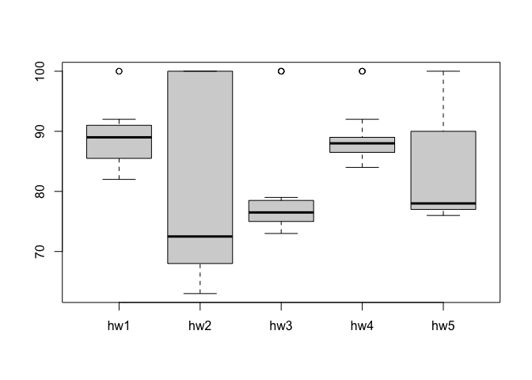

Class 6: R function
================
Andrea Sama (A59010582)
10/15/2021

## Quick Rmarkdown intro

We can write text of course just like any file. We can style text to be
**bold** or *italic*.

Do:

-   this
-   that
-   and another thing

------------------------------------------------------------------------

We can include some code:

``` r
plot(1:10)
```

<!-- -->

``` r
#This is a comment and will not be passed to R
plot(cars)
```

<!-- -->

## Time to write a function!

> Q1. Write a function grade() to determine an overall grade from a
> vector of student homework assignment scores dropping the lowest
> single score. If a student misses a homework (i.e. has an NA value)
> this can be used as a score to be potentially dropped. Your final
> function should be adquately explained with code comments and be able
> to work on an example class gradebook such as this one in CSV format:
> “<https://tinyurl.com/gradeinput>” \[3pts\]

> **Hints**:  
> Once you have a working function for vector inputs (such as the
> student1, student2, and student3 vectors below) you can use the
> apply() function to work with data frame inputs such as those obtained
> from read.csv(). Additional functions you will want to explore include
> mean(), is.na(), which.min(), which.max(), sum(), and cor(). Remember,
> you can ask for help on any function by typing a question mark before
> the function name e.g. ?sum. We will walk through many of these steps
> together in this weeks live screen-cast. However, attempting on your
> own before then is highly recommended and will be a big help for
> following the screen-cast.

``` r
# Example input vectors to start with
student1 <- c(100, 100, 100, 100, 100, 100, 100, 90)
student2 <- c(100, NA, 90, 90, 90, 90, 97, 80)
student3 <- c(90, NA, NA, NA, NA, NA, NA, NA)
```

``` r
min(student1)
```

    ## [1] 90

First I want to find the lowest score. I can use the **min()** function
to find what it is, and the **which.min()** to find where it is (the
position in the vector)

``` r
which.min(student1)
```

    ## [1] 8

get everything but the lowest score (use - in front of which.min
function)

``` r
student1[-which.min(student1)]
```

    ## [1] 100 100 100 100 100 100 100

Now I can use the **mean()** function to get the average.

``` r
mean(student1[-which.min(student1)])
```

    ## [1] 100

Does this code work for student 2?

``` r
mean(student2[-which.min(student2)])
```

    ## [1] NA

No! Why not? Does which.min work?

``` r
student2
```

    ## [1] 100  NA  90  90  90  90  97  80

``` r
which.min(student2)
```

    ## [1] 8

``` r
mean(student2)
```

    ## [1] NA

``` r
mean(student2, na.rm=TRUE)
```

    ## [1] 91

``` r
student3
```

    ## [1] 90 NA NA NA NA NA NA NA

One idea is to replace NA values with zero. Let’s try it: Step 1: find
the NAs in the vectors:(from stackexchange)

``` r
which(is.na(student2))
```

    ## [1] 2

``` r
is.na(student2)
```

    ## [1] FALSE  TRUE FALSE FALSE FALSE FALSE FALSE FALSE

**is.na** prints out a logical answer to where the NA values are in a
vector

``` r
student2[is.na(student2)]
```

    ## [1] NA

Lets replace NAs with zero

``` r
student.prime<- student2
student.prime[is.na(student.prime)]=0
student.prime
```

    ## [1] 100   0  90  90  90  90  97  80

Will this work now for student 2?

``` r
student.prime<- student2
student.prime[is.na(student.prime)]=0
mean(student.prime[-which.min(student.prime)])
```

    ## [1] 91

Yay! It works!

Will this work for student 3?

``` r
student.prime<-student3
student.prime[is.na(student.prime)]=0
mean(student.prime[-which.min(student.prime)])
```

    ## [1] 12.85714

Check that this works:

``` r
student3
```

    ## [1] 90 NA NA NA NA NA NA NA

``` r
mean(c(90, 0, 0, 0, 0, 0, 0))
```

    ## [1] 12.85714

Yes! We did it! This works, lets simplify it! change student.prime to x

``` r
x<-student3
x[is.na(x)]=0
mean(x[-which.min(x)])
```

    ## [1] 12.85714

New student! with a mistake in the code!

``` r
student4 <-c(100,  NA,  90,  90,  "90",  90,  97,  80)
```

Lets safeguard the code from any other errors that turn numeric into
characters

``` r
x<-student4
x<-as.numeric(x)
x[is.na(x)]=0
mean(x[-which.min(x)])
```

    ## [1] 91

Great! How can we save this function for further use? We can write our
function. All functions have at least three things:

-name -input args -body

``` r
grade<-function(x){
x<-as.numeric(x)
x[is.na(x)]=0
mean(x[-which.min(x)])
}
```

play it!

``` r
grade(student1)
```

    ## [1] 100

Our function works!

## Now grade the whole class

first we have to read the gradebook for the class

``` r
gradebook<-"https://tinyurl.com/gradeinput"
scores<- read.csv(gradebook, row.names=1)
scores
```

    ##            hw1 hw2 hw3 hw4 hw5
    ## student-1  100  73 100  88  79
    ## student-2   85  64  78  89  78
    ## student-3   83  69  77 100  77
    ## student-4   88  NA  73 100  76
    ## student-5   88 100  75  86  79
    ## student-6   89  78 100  89  77
    ## student-7   89 100  74  87 100
    ## student-8   89 100  76  86 100
    ## student-9   86 100  77  88  77
    ## student-10  89  72  79  NA  76
    ## student-11  82  66  78  84 100
    ## student-12 100  70  75  92 100
    ## student-13  89 100  76 100  80
    ## student-14  85 100  77  89  76
    ## student-15  85  65  76  89  NA
    ## student-16  92 100  74  89  77
    ## student-17  88  63 100  86  78
    ## student-18  91  NA 100  87 100
    ## student-19  91  68  75  86  79
    ## student-20  91  68  76  88  76

We are going to use the supper useful **apply()** function to grade all
the students with our **grade()** function

``` r
ans<-apply(scores, 1, grade)
ans
```

    ##  student-1  student-2  student-3  student-4  student-5  student-6  student-7 
    ##      91.75      82.50      84.25      84.25      88.25      89.00      94.00 
    ##  student-8  student-9 student-10 student-11 student-12 student-13 student-14 
    ##      93.75      87.75      79.00      86.00      91.75      92.25      87.75 
    ## student-15 student-16 student-17 student-18 student-19 student-20 
    ##      78.75      89.50      88.00      94.50      82.75      82.75

## Question 2: Using your grade() function and the supplied gradebook, Who is the top scoring student overall in the gradebook? \[3pts\]

``` r
which.max(ans)
```

    ## student-18 
    ##         18

## Question 3: From your analysis of the gradebook, which homework was toughest on students (i.e. obtained the lowest scores overall? \[2pts\]

``` r
ans1<-apply(scores, 2, mean)
ans1
```

    ##  hw1  hw2  hw3  hw4  hw5 
    ## 89.0   NA 80.8   NA   NA

``` r
which.min(ans1)
```

    ## hw3 
    ##   3

have to address the NA values

``` r
mask <-scores
mask[is.na(mask)]=0
mask
```

    ##            hw1 hw2 hw3 hw4 hw5
    ## student-1  100  73 100  88  79
    ## student-2   85  64  78  89  78
    ## student-3   83  69  77 100  77
    ## student-4   88   0  73 100  76
    ## student-5   88 100  75  86  79
    ## student-6   89  78 100  89  77
    ## student-7   89 100  74  87 100
    ## student-8   89 100  76  86 100
    ## student-9   86 100  77  88  77
    ## student-10  89  72  79   0  76
    ## student-11  82  66  78  84 100
    ## student-12 100  70  75  92 100
    ## student-13  89 100  76 100  80
    ## student-14  85 100  77  89  76
    ## student-15  85  65  76  89   0
    ## student-16  92 100  74  89  77
    ## student-17  88  63 100  86  78
    ## student-18  91   0 100  87 100
    ## student-19  91  68  75  86  79
    ## student-20  91  68  76  88  76

``` r
ans2<-apply(mask, 2, mean)
ans2
```

    ##   hw1   hw2   hw3   hw4   hw5 
    ## 89.00 72.80 80.80 85.15 79.25

``` r
which.min(ans2)
```

    ## hw2 
    ##   2

The hardest homework was homework 2.

## Question 4: Optional Extension: From your analysis of the gradebook, which homework was most predictive of overall score (i.e. highest correlation with average grade score)? \[1pt\]

Here we will use the **cor()** function

``` r
cor(mask$hw1, ans)
```

    ## [1] 0.4250204

``` r
cor(mask$hw2, ans)
```

    ## [1] 0.176778

``` r
cor(mask$hw3, ans)
```

    ## [1] 0.3042561

I can call the **cor()** function for everything in homework columns and
get a value for each, or I can use **apply** and do them all in one go.

``` r
apply(mask, 2, cor,ans)
```

    ##       hw1       hw2       hw3       hw4       hw5 
    ## 0.4250204 0.1767780 0.3042561 0.3810884 0.6325982

Homework 5 was the most predictive of overall score.

Make a boxplot

``` r
boxplot(scores)
```

<!-- -->

#Homework question 6:
