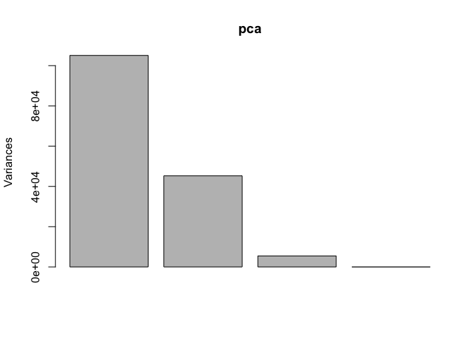
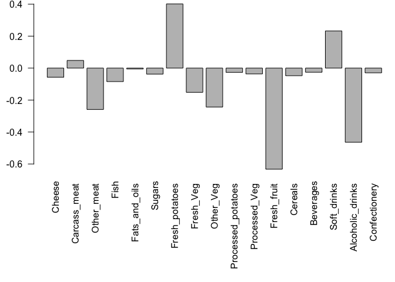

Machine Learning 1
================
Andrea Sama (A59010582)
10/22/2021

#Clustering methods: finding groupings in our data

Kmeans clustering in R is done with the `kmeans()` function.

Here we makeup some data to test and learn with.

``` r
tmp <- c(rnorm(30, 3), rnorm(30, -3))
data <- cbind(tmp, rev(tmp))
#making up a data set that reverses the order of the original
hist(tmp)
```

<!-- -->

``` r
tmp <- c(rnorm(30, 3), rnorm(30, -3))
data <- cbind(x=tmp, y=rev(tmp))
#making up a data set that reverses the order of the original
data
```

    ##                  x            y
    ##  [1,]  3.246572957 -0.788298206
    ##  [2,]  3.268125590 -3.834232869
    ##  [3,]  4.205275758 -3.348857858
    ##  [4,]  0.873317431 -3.296962993
    ##  [5,]  1.748351530 -1.318223149
    ##  [6,]  2.516180758 -3.379338890
    ##  [7,]  3.718363220 -2.561879512
    ##  [8,]  3.071290386 -2.263240192
    ##  [9,]  4.745808833 -3.545221060
    ## [10,]  1.074879984 -1.394212154
    ## [11,]  2.329024936 -2.880644310
    ## [12,]  4.021970100 -2.818283057
    ## [13,]  2.790402880 -3.324984548
    ## [14,]  3.834232317 -3.676402338
    ## [15,]  3.408100701 -3.055283602
    ## [16,]  3.798475370 -0.001399512
    ## [17,]  2.747935312 -3.446384537
    ## [18,]  2.048467358 -3.567717655
    ## [19,]  1.468893507 -3.252680568
    ## [20,]  1.895430525 -3.031121099
    ## [21,]  3.654091144 -2.995514730
    ## [22,]  3.977446688 -2.898911153
    ## [23,]  6.113061499 -4.019842556
    ## [24,]  3.047903222 -3.021620768
    ## [25,]  1.497945898 -2.242903367
    ## [26,]  2.058835803 -3.906305388
    ## [27,]  2.557635408 -2.601645466
    ## [28,]  2.238096041 -2.941504317
    ## [29,]  3.592291315 -2.457961371
    ## [30,]  3.515383449 -4.324164802
    ## [31,] -4.324164802  3.515383449
    ## [32,] -2.457961371  3.592291315
    ## [33,] -2.941504317  2.238096041
    ## [34,] -2.601645466  2.557635408
    ## [35,] -3.906305388  2.058835803
    ## [36,] -2.242903367  1.497945898
    ## [37,] -3.021620768  3.047903222
    ## [38,] -4.019842556  6.113061499
    ## [39,] -2.898911153  3.977446688
    ## [40,] -2.995514730  3.654091144
    ## [41,] -3.031121099  1.895430525
    ## [42,] -3.252680568  1.468893507
    ## [43,] -3.567717655  2.048467358
    ## [44,] -3.446384537  2.747935312
    ## [45,] -0.001399512  3.798475370
    ## [46,] -3.055283602  3.408100701
    ## [47,] -3.676402338  3.834232317
    ## [48,] -3.324984548  2.790402880
    ## [49,] -2.818283057  4.021970100
    ## [50,] -2.880644310  2.329024936
    ## [51,] -1.394212154  1.074879984
    ## [52,] -3.545221060  4.745808833
    ## [53,] -2.263240192  3.071290386
    ## [54,] -2.561879512  3.718363220
    ## [55,] -3.379338890  2.516180758
    ## [56,] -1.318223149  1.748351530
    ## [57,] -3.296962993  0.873317431
    ## [58,] -3.348857858  4.205275758
    ## [59,] -3.834232869  3.268125590
    ## [60,] -0.788298206  3.246572957

``` r
plot(data)
```

<!-- -->

Run `kmeans()` set k (centers) to 2 (ie the number of clusters that we
want) nstart 20. The thing with Kmeans is you have to tell it how many
clusters you want.

``` r
km<-kmeans(data, centers=2, nstart=20)
km
```

    ## K-means clustering with 2 clusters of sizes 30, 30
    ## 
    ## Cluster means:
    ##           x         y
    ## 1  2.968793 -2.873191
    ## 2 -2.873191  2.968793
    ## 
    ## Clustering vector:
    ##  [1] 1 1 1 1 1 1 1 1 1 1 1 1 1 1 1 1 1 1 1 1 1 1 1 1 1 1 1 1 1 1 2 2 2 2 2 2 2 2
    ## [39] 2 2 2 2 2 2 2 2 2 2 2 2 2 2 2 2 2 2 2 2 2 2
    ## 
    ## Within cluster sum of squares by cluster:
    ## [1] 65.08193 65.08193
    ##  (between_SS / total_SS =  88.7 %)
    ## 
    ## Available components:
    ## 
    ## [1] "cluster"      "centers"      "totss"        "withinss"     "tot.withinss"
    ## [6] "betweenss"    "size"         "iter"         "ifault"

> Q: How many points are in each cluster?

``` r
km$size
```

    ## [1] 30 30

> Q. What ‘component’ of your result details cluster
> assignment/membership?

``` r
km$cluster
```

    ##  [1] 1 1 1 1 1 1 1 1 1 1 1 1 1 1 1 1 1 1 1 1 1 1 1 1 1 1 1 1 1 1 2 2 2 2 2 2 2 2
    ## [39] 2 2 2 2 2 2 2 2 2 2 2 2 2 2 2 2 2 2 2 2 2 2

> Q. What ‘component’ of your result object details cluster center?

``` r
km$centers
```

    ##           x         y
    ## 1  2.968793 -2.873191
    ## 2 -2.873191  2.968793

> Q. Plot x colored by the kmeans cluster assignment and add cluster
> centers as blue points.

``` r
plot(data, col=km$cluster)
points(km$centers, col="blue", pch=15, cex=2)
```

<!-- -->

#hclust We will use the `hclust()` function on the same data as before
and see how this method works.

``` r
#hclust(data)
```

gives an error, needs a distance.

``` r
hc<-hclust(dist(data))
hc
```

    ## 
    ## Call:
    ## hclust(d = dist(data))
    ## 
    ## Cluster method   : complete 
    ## Distance         : euclidean 
    ## Number of objects: 60

doesnt give a lot of information, but does provide a plot method.

``` r
plot(hc)
abline(h=7, col="red")
```

<!-- -->

TO find our membership vector we need to “cut” the tree and for this we
use the `cutree()` function and tell it the height to cut at.

``` r
cutree(hc, h=7)
```

    ##  [1] 1 1 1 1 1 1 1 1 1 1 1 1 1 1 1 1 1 1 1 1 1 1 1 1 1 1 1 1 1 1 2 2 2 2 2 2 2 2
    ## [39] 2 2 2 2 2 2 2 2 2 2 2 2 2 2 2 2 2 2 2 2 2 2

If you dont know what the height is you can use cut at k=? use
`cutree()` and state the number of k clusters that we want.

``` r
grps<- cutree(hc, k=2)
```

``` r
plot(data, col= grps)
```

<!-- -->

kmeans(x, centers=?) hclust(dist(x))

#Principal Component Analysis (PCA) PCA projects the features onto the
principal components The motivation is to reduce the features
dimensionality while only losing a small amount of information

New low dimension axis or surfaces closest to the observations

The first PCA:Line of best fit that lies closest to data that describes
the spread of the data

#PCA of UK diets

``` r
url <- "https://tinyurl.com/UK-foods"
x <- read.csv(url)
```

How many rows and columns?

``` r
dim(x)
```

    ## [1] 17  5

``` r
x
```

    ##                      X England Wales Scotland N.Ireland
    ## 1               Cheese     105   103      103        66
    ## 2        Carcass_meat      245   227      242       267
    ## 3          Other_meat      685   803      750       586
    ## 4                 Fish     147   160      122        93
    ## 5       Fats_and_oils      193   235      184       209
    ## 6               Sugars     156   175      147       139
    ## 7      Fresh_potatoes      720   874      566      1033
    ## 8           Fresh_Veg      253   265      171       143
    ## 9           Other_Veg      488   570      418       355
    ## 10 Processed_potatoes      198   203      220       187
    ## 11      Processed_Veg      360   365      337       334
    ## 12        Fresh_fruit     1102  1137      957       674
    ## 13            Cereals     1472  1582     1462      1494
    ## 14           Beverages      57    73       53        47
    ## 15        Soft_drinks     1374  1256     1572      1506
    ## 16   Alcoholic_drinks      375   475      458       135
    ## 17      Confectionery       54    64       62        41

The x is considered a column but we want it to be read as a row One
option

``` r
x[,-1]
```

    ##    England Wales Scotland N.Ireland
    ## 1      105   103      103        66
    ## 2      245   227      242       267
    ## 3      685   803      750       586
    ## 4      147   160      122        93
    ## 5      193   235      184       209
    ## 6      156   175      147       139
    ## 7      720   874      566      1033
    ## 8      253   265      171       143
    ## 9      488   570      418       355
    ## 10     198   203      220       187
    ## 11     360   365      337       334
    ## 12    1102  1137      957       674
    ## 13    1472  1582     1462      1494
    ## 14      57    73       53        47
    ## 15    1374  1256     1572      1506
    ## 16     375   475      458       135
    ## 17      54    64       62        41

``` r
rownames(x) <-x[, 1]
x<-x[,-1]
x
```

    ##                     England Wales Scotland N.Ireland
    ## Cheese                  105   103      103        66
    ## Carcass_meat            245   227      242       267
    ## Other_meat              685   803      750       586
    ## Fish                    147   160      122        93
    ## Fats_and_oils           193   235      184       209
    ## Sugars                  156   175      147       139
    ## Fresh_potatoes          720   874      566      1033
    ## Fresh_Veg               253   265      171       143
    ## Other_Veg               488   570      418       355
    ## Processed_potatoes      198   203      220       187
    ## Processed_Veg           360   365      337       334
    ## Fresh_fruit            1102  1137      957       674
    ## Cereals                1472  1582     1462      1494
    ## Beverages                57    73       53        47
    ## Soft_drinks            1374  1256     1572      1506
    ## Alcoholic_drinks        375   475      458       135
    ## Confectionery            54    64       62        41

``` r
url <- "https://tinyurl.com/UK-foods"
x <- read.csv(url, row.names=1)
x
```

    ##                     England Wales Scotland N.Ireland
    ## Cheese                  105   103      103        66
    ## Carcass_meat            245   227      242       267
    ## Other_meat              685   803      750       586
    ## Fish                    147   160      122        93
    ## Fats_and_oils           193   235      184       209
    ## Sugars                  156   175      147       139
    ## Fresh_potatoes          720   874      566      1033
    ## Fresh_Veg               253   265      171       143
    ## Other_Veg               488   570      418       355
    ## Processed_potatoes      198   203      220       187
    ## Processed_Veg           360   365      337       334
    ## Fresh_fruit            1102  1137      957       674
    ## Cereals                1472  1582     1462      1494
    ## Beverages                57    73       53        47
    ## Soft_drinks            1374  1256     1572      1506
    ## Alcoholic_drinks        375   475      458       135
    ## Confectionery            54    64       62        41

``` r
barplot(as.matrix(x), col=rainbow(17))
```

<!-- -->

``` r
mycols <- rainbow(nrow(x))
pairs(x, col=mycols, pch=16)
```

<!-- -->

##PCA to the rescue!

Here we will use the base R function for PCA, which is called
`precomp()`. This function wants the transpose of our data.

``` r
pca<-prcomp( t(x) )
summary(pca)
```

    ## Importance of components:
    ##                             PC1      PC2      PC3       PC4
    ## Standard deviation     324.1502 212.7478 73.87622 4.189e-14
    ## Proportion of Variance   0.6744   0.2905  0.03503 0.000e+00
    ## Cumulative Proportion    0.6744   0.9650  1.00000 1.000e+00

PC1 captures 67%, PC2 captures 29%, Cumulative proportion is the
addition of the porportion of variances for the PCs

``` r
plot(pca)
```

<!-- -->
We want score plot (aka PCA plot). Basically a plot of PC1 vs PC2

``` r
attributes(pca) 
```

    ## $names
    ## [1] "sdev"     "rotation" "center"   "scale"    "x"       
    ## 
    ## $class
    ## [1] "prcomp"

We are after the pca$x component

``` r
plot(pca$x[,1:2])
text(pca$x[,1:2], labels=colnames(x))
```

<!-- -->
Northern Ireland is really different than these other three countries.
PCA will tell us why they are different, how much each of the different
foods contributed to the differences.

We can also examine the PCA “loadings”, which tell us how much the
original variables contribute to each new PC…

``` r
par(mar=c(10, 3, 0.35, 0))
barplot(pca$rotation[,1], las=2)
```

<!-- -->

## One more PCA for today

``` r
url2 <- "https://tinyurl.com/expression-CSV"
rna.data <- read.csv(url2, row.names=1)
head(rna.data)
```

    ##        wt1 wt2  wt3  wt4 wt5 ko1 ko2 ko3 ko4 ko5
    ## gene1  439 458  408  429 420  90  88  86  90  93
    ## gene2  219 200  204  210 187 427 423 434 433 426
    ## gene3 1006 989 1030 1017 973 252 237 238 226 210
    ## gene4  783 792  829  856 760 849 856 835 885 894
    ## gene5  181 249  204  244 225 277 305 272 270 279
    ## gene6  460 502  491  491 493 612 594 577 618 638

``` r
ncol(rna.data)
```

    ## [1] 10

``` r
colnames(rna.data)
```

    ##  [1] "wt1" "wt2" "wt3" "wt4" "wt5" "ko1" "ko2" "ko3" "ko4" "ko5"

``` r
nrow(rna.data)
```

    ## [1] 100

``` r
pca.rna <- prcomp( t(rna.data), scale=TRUE )
summary(pca.rna)
```

    ## Importance of components:
    ##                           PC1    PC2     PC3     PC4     PC5     PC6     PC7
    ## Standard deviation     9.6237 1.5198 1.05787 1.05203 0.88062 0.82545 0.80111
    ## Proportion of Variance 0.9262 0.0231 0.01119 0.01107 0.00775 0.00681 0.00642
    ## Cumulative Proportion  0.9262 0.9493 0.96045 0.97152 0.97928 0.98609 0.99251
    ##                            PC8     PC9      PC10
    ## Standard deviation     0.62065 0.60342 3.348e-15
    ## Proportion of Variance 0.00385 0.00364 0.000e+00
    ## Cumulative Proportion  0.99636 1.00000 1.000e+00

``` r
plot(pca.rna)
```

<!-- -->

``` r
plot(pca.rna$x[,1:2])
text(pca.rna$x[,1:2], labels=colnames(rna.data))
```

<!-- -->

PC1 did a good job accounting for the separation between WT and KO. If
you go to the loadings you can find what is responsible for the
variation.

Lets knit to PDF and publish to github
