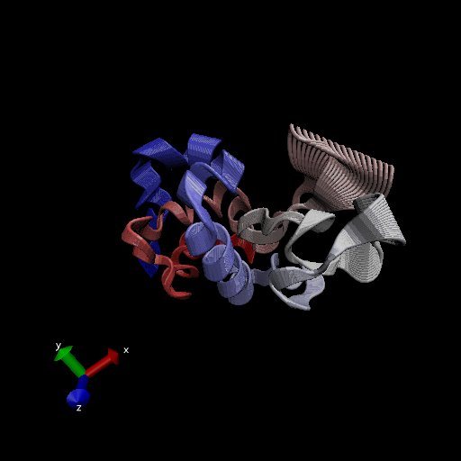
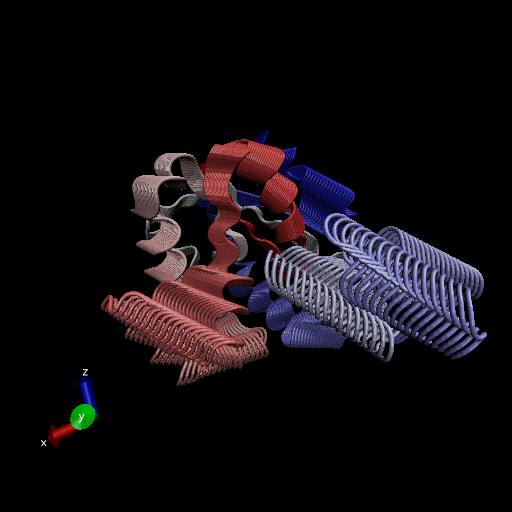
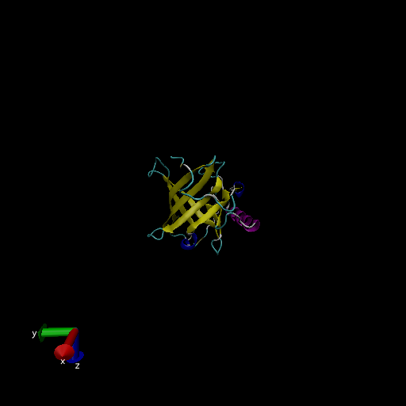

#working with bio3d

```{r}
library(bio3d)
pdb <- read.pdb("1hel")
pdb

```

```{r}

head(pdb$atom)
```

Lets do a quick bioinformatics predriction of protein dynamics (flexiblity). We use the `nma()` function which does the Normal Mode Analysis.

```{r}
modes <- nma(pdb)
plot(modes)
```

Make a trajectory of this prediction with the `mktrj()` .

```{r}
mktrj(modes, file="nma.pdb")
```




##Comparative Structrue Analysis

start by getting a sequence of interest

```{r}
aa <- get.seq("1AKE_A")
aa
```


search the PDB database:
I search the PDB database (the main db for exp structures) for sequences like my aa sequence. 
```{r}
blast <- blast.pdb(aa)
```

```{r}
hits<-plot(blast)
```


Now I have my top hits from the search of the PDB, these are the structures in the database most like mine.

```{r}
hits$pdb.id
```

Here we download all the similar structures in the PDB and store them on our computer.

```{r}
#Download related PDB files

files<- get.pdb(hits$pdb.id, path ="pdbs", split=TRUE, gzip=TRUE)
```


Now we align these structures using function `pdbaln()` 
MSA 

```{r}
# Align releated PDBs
pdbs <- pdbaln(files, fit = TRUE) 
```

Let's have a look:

```{r}
pdbs

```

```{r}
ids<- basename.pdb(pdbs$id)
plot(pdbs, labels=ids)
```


Now for the PCA step
```{r}
pdbs$xyz
```

##Principal Component Analysis (PCA)

Here we will do PCA on the xyz coordinate data of all these structures witht he `pca()` function in bio3d

```{r}
pc <- pca(pdbs)
plot(pc)
```

Lets visualize the displacement (ie the movements of the structure ) that are captured by PC1

```{r}
mktrj(pc, pc=1, file="pca.pdb")
```




Lets save our important results:

```{r}
save(blast, hits, pca, pdbs, file="myresults.RData")
#load("myresults.RData")
```


my protein

yay!