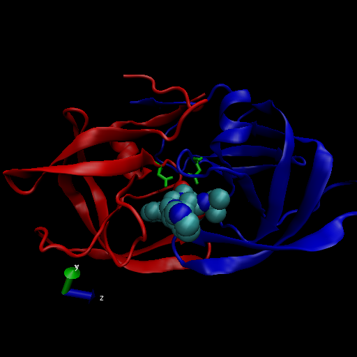

#Q1: What percentage of structures in the PDB are solved by X-Ray and Electron Microscopy.

```{r}
data <- read.csv("Data Export Summary.csv", row.names=1)
data
```
```{r}
sum(data$X.ray)/sum(data$Total)*100
sum(data$EM)/sum(data$Total)*100
```

#Q2: What proportion of structures in the PDB are protein?

```{r}
proteins <- data[1,7]
proteins/sum(data$Total)*100

```

#Q3: Type HIV in the PDB website search box on the home page and determine how many HIV-1 protease structures are in the current PDB?

234

#Q4: Water molecules normally have 3 atoms. Why do we see just one atom per water molecule in this structure?

We dont see the hydrogen atoms because the resolution of the structure is 1.9 A

#Render of image
```{r}

```


#Q5: There is a conserved water molecule in the binding site. Can you identify this water molecule? What residue number does this water molecule have (see note below)?
HOH308:0

#Using Bio3D in R for structural bioinformatics.

```{r}
library(bio3d)

pdb<- read.pdb("1hel")
pdb
```


```{r}
pdb$atom
head(pdb$atom)
```


```{r}
m<-nma(pdb)
plot(m)

```

```{r}
mktrj(m, file="nma.pdb")
```


