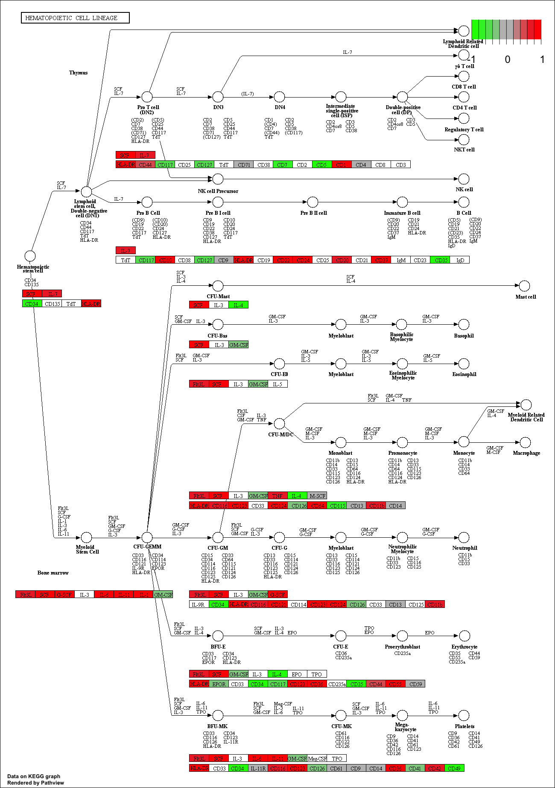
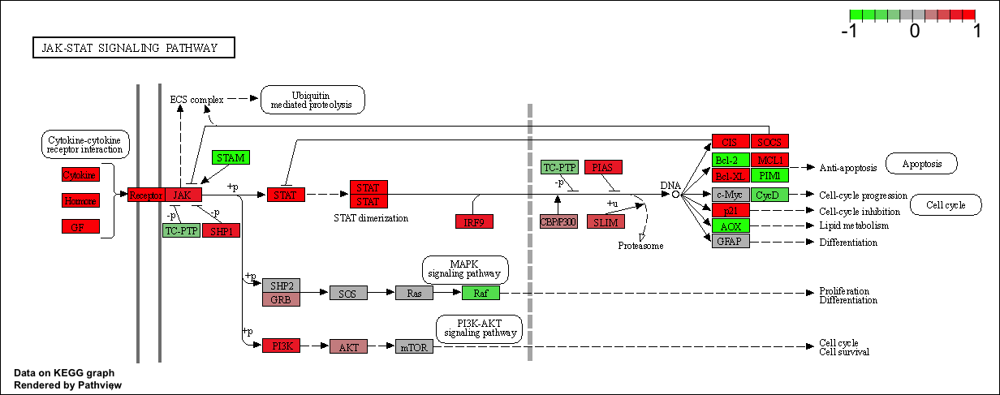

```{r}
library(DESeq2)

```


```{r}
metaFile <- "GSE37704_metadata.csv"
countFile <- "GSE37704_featurecounts.csv"

# Import metadata and take a peak
colData = read.csv(metaFile, row.names=1)
head(colData)


```

```{r}
# Import countdata
countData = read.csv(countFile, row.names=1)
head(countData)
```


```{r}
# Note we need to remove the odd first $length col
countData <- as.matrix(countData[,-1])
head(countData)
```


```{r}
# Filter count data where you have 0 read count across all samples.
countData = countData[which(rowSums(countData)!=0), ]
head(countData)
```

#PCA analysis

```{r}
pca<-prcomp(t(countData))
summary(pca)
```


```{r}
plot(pca$x[,1:2])
```

```{r}
plot(pca$x[,1:2], pch=16, col=as.factor(colData$condition))
text(pca$x[,1:2], labels=colData$condition)
```


```{r}
dds = DESeqDataSetFromMatrix(countData=countData,
                             colData=colData,
                             design=~condition)
dds = DESeq(dds)
```

```{r}
dds
```

```{r}
res=results(dds)
```

```{r}
summary(res)
```

```{r}
plot( res$log2FoldChange, -log(res$padj) )
```

```{r}
# Make a color vector for all genes
mycols <- rep("gray", nrow(res) )

# Color red the genes with absolute fold change above 2
mycols[ abs(res$log2FoldChange) > 2 ] <- "red"

# Color blue those with adjusted p-value less than 0.01
#  and absolute fold change more than 2
inds <- (res$padj<0.1) & (abs(res$log2FoldChange) > 2 )
mycols[ inds ] <- "blue"

plot( res$log2FoldChange, -log(res$padj), col= mycols, xlab="Log2(FoldChange)", ylab="-Log(P-value)" )
```

#Adding gene annotation

```{r}
library("AnnotationDbi")
library("org.Hs.eg.db")

columns(org.Hs.eg.db)

res$symbol = mapIds(org.Hs.eg.db,
                    keys=row.names(res), 
                    keytype="ENSEMBL",
                    column="SYMBOL",
                    multiVals="first")

res$entrez = mapIds(org.Hs.eg.db,
                    keys=row.names(res),
                    keytype="ENSEMBL",
                    column="ENTREZID",
                    multiVals="first")

res$name =   mapIds(org.Hs.eg.db,
                    keys=row.names(res),
                    keytype="ENSEMBL",
                    column="GENENAME",
                    multiVals="first")

head(res, 10)
```

```{r}
res = res[order(res$pvalue),]
write.csv(res, file="deseq_results.csv")

```

##Section 2: Pathway Analysis

```{r}
# Run in your R console (i.e. not your Rmarkdown doc!)


# For old vesrsions of R only (R < 3.5.0)!
#source("http://bioconductor.org/biocLite.R")
#biocLite( c("pathview", "gage", "gageData") )
```


```{r}
library(pathview)
```


```{r}
library(gage)
library(gageData)

data(kegg.sets.hs)
data(sigmet.idx.hs)

# Focus on signaling and metabolic pathways only
kegg.sets.hs = kegg.sets.hs[sigmet.idx.hs]

# Examine the first 3 pathways
head(kegg.sets.hs, 3)

```

```{r}
foldchanges = res$log2FoldChange
names(foldchanges) = res$entrez
head(foldchanges)
```

```{r}
# Get the results
keggres = gage(foldchanges, gsets=kegg.sets.hs)

```

```{r}
attributes(keggres)
```

```{r}
# Look at the first few down (less) pathways
head(keggres$less)
```

```{r}
pathview(gene.data=foldchanges, pathway.id="hsa04110")
```


```{r}
# A different PDF based output of the same data
pathview(gene.data=foldchanges, pathway.id="hsa04110", kegg.native=FALSE)
```


```{r}
## Focus on top 5 upregulated pathways here for demo purposes only
keggrespathways <- rownames(keggres$greater)[1:5]

# Extract the 8 character long IDs part of each string
keggresids = substr(keggrespathways, start=1, stop=8)
keggresids
```


```{r}
pathview(gene.data=foldchanges, pathway.id=keggresids, species="hsa")
```






```{r}
## Focus on top 5 upregulated pathways here for demo purposes only
keggresdownpathways <- rownames(keggres$less)[1:5]

# Extract the 8 character long IDs part of each string
keggresids = substr(keggresdownpathways, start=1, stop=8)
keggresids
```

##Section 3

```{r}
data(go.sets.hs)
data(go.subs.hs)

# Focus on Biological Process subset of GO
gobpsets = go.sets.hs[go.subs.hs$BP]

gobpres = gage(foldchanges, gsets=gobpsets, same.dir=TRUE)

lapply(gobpres, head)
```

##Section 4:

```{r}
sig_genes <- res[res$padj <= 0.05 & !is.na(res$padj), "symbol"]
print(paste("Total number of significant genes:", length(sig_genes)))
```

```{r}
write.table(sig_genes, file="significant_genes.txt", row.names=FALSE, col.names=FALSE, quote=FALSE)
```


The most significant entities p-value is the endosomal/vacuolar pathway. The KEGG results were much more broad, they just listed Cell Cycle as important pathways whereas in the reactome database it specifies the exact pathways that are included in its cell cycle mediation. This is probably a larger database. Because there are differences in the databases that are used we get different specific pathways, however we can see that there is a relationship between the pathways predicted by both databases.


