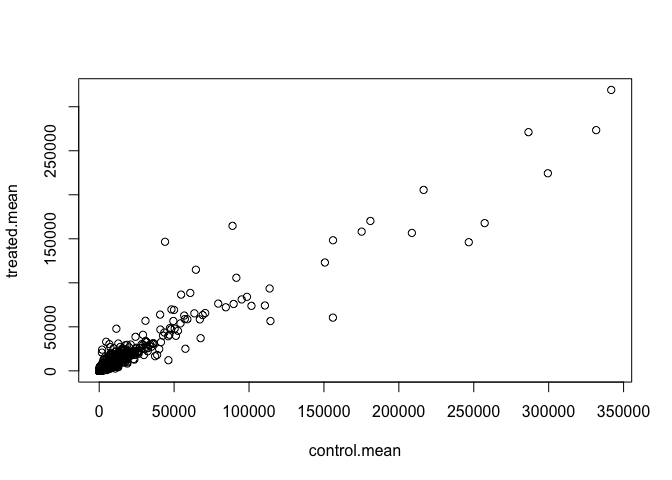
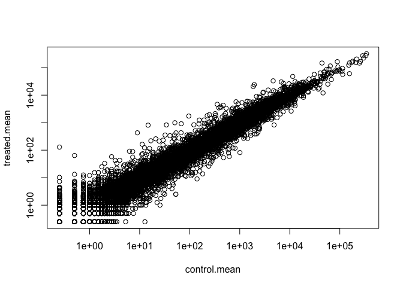
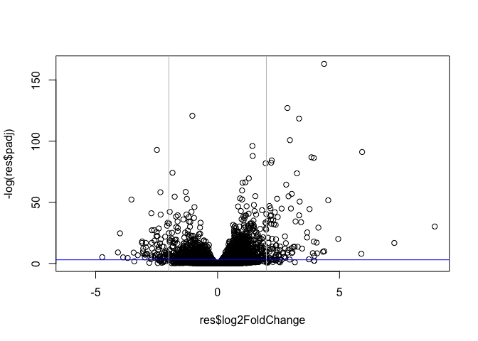

class_15
================
Andrea Sama (A59010582)
11/17/2021

#RNA Seq Analysis

#Background

Today we examined a published RNA-Seq experiement where airway smooth
muscle cells were treated with dexamethasone, a synthetics something
with anit-inflammatory effects

##Load the contData and colData

``` r
counts<-read.csv("airway_scaledcounts.csv", row.names = 1)

metadata <- read.csv("airway_metadata.csv")
```

``` r
head(counts)
```

    ##                 SRR1039508 SRR1039509 SRR1039512 SRR1039513 SRR1039516
    ## ENSG00000000003        723        486        904        445       1170
    ## ENSG00000000005          0          0          0          0          0
    ## ENSG00000000419        467        523        616        371        582
    ## ENSG00000000457        347        258        364        237        318
    ## ENSG00000000460         96         81         73         66        118
    ## ENSG00000000938          0          0          1          0          2
    ##                 SRR1039517 SRR1039520 SRR1039521
    ## ENSG00000000003       1097        806        604
    ## ENSG00000000005          0          0          0
    ## ENSG00000000419        781        417        509
    ## ENSG00000000457        447        330        324
    ## ENSG00000000460         94        102         74
    ## ENSG00000000938          0          0          0

``` r
head(metadata)
```

    ##           id     dex celltype     geo_id
    ## 1 SRR1039508 control   N61311 GSM1275862
    ## 2 SRR1039509 treated   N61311 GSM1275863
    ## 3 SRR1039512 control  N052611 GSM1275866
    ## 4 SRR1039513 treated  N052611 GSM1275867
    ## 5 SRR1039516 control  N080611 GSM1275870
    ## 6 SRR1039517 treated  N080611 GSM1275871

Side-note: lets check the corespondence of the metadata and count data
setup.

``` r
metadata[,1]==colnames(counts)
```

    ## [1] TRUE TRUE TRUE TRUE TRUE TRUE TRUE TRUE

or

``` r
metadata$id==colnames(counts)
```

    ## [1] TRUE TRUE TRUE TRUE TRUE TRUE TRUE TRUE

We can use the `==` to see if they are the same

``` r
all( c(T, T, T, T, F))
```

    ## [1] FALSE

``` r
all(metadata$id==colnames(counts))
```

    ## [1] TRUE

``` r
#View(metadata)
#View(counts)
```

##Compare treated and control. First we need to access all the control
columns in our counts data.

``` r
control.inds<-metadata$dex=="control"

control.ids <- metadata[ control.inds, ]$id
```

Use these ids to access just the control columns of our `counts` data

``` r
head(counts[, control.ids])
```

    ##                 SRR1039508 SRR1039512 SRR1039516 SRR1039520
    ## ENSG00000000003        723        904       1170        806
    ## ENSG00000000005          0          0          0          0
    ## ENSG00000000419        467        616        582        417
    ## ENSG00000000457        347        364        318        330
    ## ENSG00000000460         96         73        118        102
    ## ENSG00000000938          0          1          2          0

``` r
control.mean <-rowMeans(counts[,control.ids])
head(control.mean)
```

    ## ENSG00000000003 ENSG00000000005 ENSG00000000419 ENSG00000000457 ENSG00000000460 
    ##          900.75            0.00          520.50          339.75           97.25 
    ## ENSG00000000938 
    ##            0.75

Now do this for treated:

``` r
treated.inds<-metadata$dex=="treated"

treated.ids <- metadata[ treated.inds, ]$id
treated.ids
```

    ## [1] "SRR1039509" "SRR1039513" "SRR1039517" "SRR1039521"

``` r
head(counts[, treated.ids])
```

    ##                 SRR1039509 SRR1039513 SRR1039517 SRR1039521
    ## ENSG00000000003        486        445       1097        604
    ## ENSG00000000005          0          0          0          0
    ## ENSG00000000419        523        371        781        509
    ## ENSG00000000457        258        237        447        324
    ## ENSG00000000460         81         66         94         74
    ## ENSG00000000938          0          0          0          0

``` r
treated.mean <-rowMeans(counts[,treated.ids])
head(treated.mean)
```

    ## ENSG00000000003 ENSG00000000005 ENSG00000000419 ENSG00000000457 ENSG00000000460 
    ##          658.00            0.00          546.00          316.50           78.75 
    ## ENSG00000000938 
    ##            0.00

We will combine for bookkeeping purposes

``` r
meancounts <-data.frame(control.mean, treated.mean)
#meancounts
```

``` r
nrow(counts)
```

    ## [1] 38694

There are 38694 rows/genese in this dataset

##Compare the control and treated

Quick plot of our progress so far

``` r
plot(meancounts)
```

<!-- --> This data
would greatly benefit fron a log transform! Lets plot on a log log scale

``` r
plot(meancounts, log="xy")
```

    ## Warning in xy.coords(x, y, xlabel, ylabel, log): 15032 x values <= 0 omitted
    ## from logarithmic plot

    ## Warning in xy.coords(x, y, xlabel, ylabel, log): 15281 y values <= 0 omitted
    ## from logarithmic plot

<!-- -->

We often use log transformations as they make life much nicer in this
world…

``` r
log2(10/20)
```

    ## [1] -1

``` r
log2(80/20)
```

    ## [1] 2

Cool. I like log2!

``` r
#Here we have added a new colum to the dataframe that includes the log2 values of the treated/control.

meancounts$log2fc <-log2(meancounts[,"treated.mean"]/meancounts[,"control.mean"])
head(meancounts)
```

    ##                 control.mean treated.mean      log2fc
    ## ENSG00000000003       900.75       658.00 -0.45303916
    ## ENSG00000000005         0.00         0.00         NaN
    ## ENSG00000000419       520.50       546.00  0.06900279
    ## ENSG00000000457       339.75       316.50 -0.10226805
    ## ENSG00000000460        97.25        78.75 -0.30441833
    ## ENSG00000000938         0.75         0.00        -Inf

We need to drop the zero count genes! use the `which()` function

``` r
head(meancounts[, 1:2])
```

    ##                 control.mean treated.mean
    ## ENSG00000000003       900.75       658.00
    ## ENSG00000000005         0.00         0.00
    ## ENSG00000000419       520.50       546.00
    ## ENSG00000000457       339.75       316.50
    ## ENSG00000000460        97.25        78.75
    ## ENSG00000000938         0.75         0.00

``` r
head(meancounts[, 1:2]==0)
```

    ##                 control.mean treated.mean
    ## ENSG00000000003        FALSE        FALSE
    ## ENSG00000000005         TRUE         TRUE
    ## ENSG00000000419        FALSE        FALSE
    ## ENSG00000000457        FALSE        FALSE
    ## ENSG00000000460        FALSE        FALSE
    ## ENSG00000000938        FALSE         TRUE

The `which()` function tells us the indices of TRUE entries in a logical
vector.

``` r
which(c(T,F,T,F,F,T))
```

    ## [1] 1 3 6

However, it is not that useful in default mode on our type of multi
column input…

``` r
inds <-which(meancounts[,1:2]==0, arr.ind = TRUE)
```

I only care about the rows here (if there is a zero in any column I will
exclude this row eventually).

``` r
to.rm<-unique(sort(inds[,"row"]))
```

``` r
head(meancounts[to.rm,])
```

    ##                 control.mean treated.mean log2fc
    ## ENSG00000000005         0.00         0.00    NaN
    ## ENSG00000000938         0.75         0.00   -Inf
    ## ENSG00000004848         0.00         0.25    Inf
    ## ENSG00000004948         0.00         0.00    NaN
    ## ENSG00000005001         0.00         0.00    NaN
    ## ENSG00000005102         1.00         0.00   -Inf

the above are the genes we want to remove below is the genes we can use:

``` r
head(meancounts[-to.rm,])
```

    ##                 control.mean treated.mean      log2fc
    ## ENSG00000000003       900.75       658.00 -0.45303916
    ## ENSG00000000419       520.50       546.00  0.06900279
    ## ENSG00000000457       339.75       316.50 -0.10226805
    ## ENSG00000000460        97.25        78.75 -0.30441833
    ## ENSG00000000971      5219.00      6687.50  0.35769358
    ## ENSG00000001036      2327.00      1785.75 -0.38194109

``` r
mycounts <-meancounts[-to.rm,]
```

We now have 21817genes remaining

``` r
nrow(mycounts)
```

    ## [1] 21817

How many of these genes are up regulated at the log2 fold-change
threshold of +2 or greater

``` r
sum(mycounts$log2fc > +2)
```

    ## [1] 250

250 genes are upregulated! The Trues are 1 False is 0

``` r
round((sum(mycounts$log2fc > +2)/nrow(mycounts))*100,2)
```

    ## [1] 1.15

``` r
round((sum(mycounts$log2fc < -2)/nrow(mycounts))*100,2)
```

    ## [1] 1.68

Above is downregulated

#DESeq Analysis

``` r
library(DESeq2)
```

    ## Loading required package: S4Vectors

    ## Loading required package: stats4

    ## Loading required package: BiocGenerics

    ## 
    ## Attaching package: 'BiocGenerics'

    ## The following objects are masked from 'package:stats':
    ## 
    ##     IQR, mad, sd, var, xtabs

    ## The following objects are masked from 'package:base':
    ## 
    ##     anyDuplicated, append, as.data.frame, basename, cbind, colnames,
    ##     dirname, do.call, duplicated, eval, evalq, Filter, Find, get, grep,
    ##     grepl, intersect, is.unsorted, lapply, Map, mapply, match, mget,
    ##     order, paste, pmax, pmax.int, pmin, pmin.int, Position, rank,
    ##     rbind, Reduce, rownames, sapply, setdiff, sort, table, tapply,
    ##     union, unique, unsplit, which.max, which.min

    ## 
    ## Attaching package: 'S4Vectors'

    ## The following objects are masked from 'package:base':
    ## 
    ##     expand.grid, I, unname

    ## Loading required package: IRanges

    ## Loading required package: GenomicRanges

    ## Loading required package: GenomeInfoDb

    ## Loading required package: SummarizedExperiment

    ## Loading required package: MatrixGenerics

    ## Loading required package: matrixStats

    ## 
    ## Attaching package: 'MatrixGenerics'

    ## The following objects are masked from 'package:matrixStats':
    ## 
    ##     colAlls, colAnyNAs, colAnys, colAvgsPerRowSet, colCollapse,
    ##     colCounts, colCummaxs, colCummins, colCumprods, colCumsums,
    ##     colDiffs, colIQRDiffs, colIQRs, colLogSumExps, colMadDiffs,
    ##     colMads, colMaxs, colMeans2, colMedians, colMins, colOrderStats,
    ##     colProds, colQuantiles, colRanges, colRanks, colSdDiffs, colSds,
    ##     colSums2, colTabulates, colVarDiffs, colVars, colWeightedMads,
    ##     colWeightedMeans, colWeightedMedians, colWeightedSds,
    ##     colWeightedVars, rowAlls, rowAnyNAs, rowAnys, rowAvgsPerColSet,
    ##     rowCollapse, rowCounts, rowCummaxs, rowCummins, rowCumprods,
    ##     rowCumsums, rowDiffs, rowIQRDiffs, rowIQRs, rowLogSumExps,
    ##     rowMadDiffs, rowMads, rowMaxs, rowMeans2, rowMedians, rowMins,
    ##     rowOrderStats, rowProds, rowQuantiles, rowRanges, rowRanks,
    ##     rowSdDiffs, rowSds, rowSums2, rowTabulates, rowVarDiffs, rowVars,
    ##     rowWeightedMads, rowWeightedMeans, rowWeightedMedians,
    ##     rowWeightedSds, rowWeightedVars

    ## Loading required package: Biobase

    ## Welcome to Bioconductor
    ## 
    ##     Vignettes contain introductory material; view with
    ##     'browseVignettes()'. To cite Bioconductor, see
    ##     'citation("Biobase")', and for packages 'citation("pkgname")'.

    ## 
    ## Attaching package: 'Biobase'

    ## The following object is masked from 'package:MatrixGenerics':
    ## 
    ##     rowMedians

    ## The following objects are masked from 'package:matrixStats':
    ## 
    ##     anyMissing, rowMedians

we first need to set up the DESeq input object.

``` r
dds <- DESeqDataSetFromMatrix(countData=counts, 
                              colData=metadata, 
                              design=~dex)
```

    ## converting counts to integer mode

    ## Warning in DESeqDataSet(se, design = design, ignoreRank): some variables in
    ## design formula are characters, converting to factors

``` r
dds
```

    ## class: DESeqDataSet 
    ## dim: 38694 8 
    ## metadata(1): version
    ## assays(1): counts
    ## rownames(38694): ENSG00000000003 ENSG00000000005 ... ENSG00000283120
    ##   ENSG00000283123
    ## rowData names(0):
    ## colnames(8): SRR1039508 SRR1039509 ... SRR1039520 SRR1039521
    ## colData names(4): id dex celltype geo_id

Run the DESeq analysis pipeline

``` r
dds <-DESeq(dds)
```

    ## estimating size factors

    ## estimating dispersions

    ## gene-wise dispersion estimates

    ## mean-dispersion relationship

    ## final dispersion estimates

    ## fitting model and testing

``` r
res <-results(dds)
head(res)
```

    ## log2 fold change (MLE): dex treated vs control 
    ## Wald test p-value: dex treated vs control 
    ## DataFrame with 6 rows and 6 columns
    ##                   baseMean log2FoldChange     lfcSE      stat    pvalue
    ##                  <numeric>      <numeric> <numeric> <numeric> <numeric>
    ## ENSG00000000003 747.194195     -0.3507030  0.168246 -2.084470 0.0371175
    ## ENSG00000000005   0.000000             NA        NA        NA        NA
    ## ENSG00000000419 520.134160      0.2061078  0.101059  2.039475 0.0414026
    ## ENSG00000000457 322.664844      0.0245269  0.145145  0.168982 0.8658106
    ## ENSG00000000460  87.682625     -0.1471420  0.257007 -0.572521 0.5669691
    ## ENSG00000000938   0.319167     -1.7322890  3.493601 -0.495846 0.6200029
    ##                      padj
    ##                 <numeric>
    ## ENSG00000000003  0.163035
    ## ENSG00000000005        NA
    ## ENSG00000000419  0.176032
    ## ENSG00000000457  0.961694
    ## ENSG00000000460  0.815849
    ## ENSG00000000938        NA

#A volcano plot

This is a very common data visualization of this type of data that does
not really look like a volcano unfortunately.

``` r
plot(res$log2FoldChange, res$padj)
```

<!-- -->

``` r
plot(res$log2FoldChange, -log(res$padj))
abline(v=c(-2,2), col="gray")
abline(h=-log(0.05),col="blue")
```

<!-- -->

#Add annotation data

``` r
library("AnnotationDbi")
```

    ## Warning: package 'AnnotationDbi' was built under R version 4.1.2

``` r
library("org.Hs.eg.db")
```

    ## 

``` r
columns(org.Hs.eg.db)
```

    ##  [1] "ACCNUM"       "ALIAS"        "ENSEMBL"      "ENSEMBLPROT"  "ENSEMBLTRANS"
    ##  [6] "ENTREZID"     "ENZYME"       "EVIDENCE"     "EVIDENCEALL"  "GENENAME"    
    ## [11] "GENETYPE"     "GO"           "GOALL"        "IPI"          "MAP"         
    ## [16] "OMIM"         "ONTOLOGY"     "ONTOLOGYALL"  "PATH"         "PFAM"        
    ## [21] "PMID"         "PROSITE"      "REFSEQ"       "SYMBOL"       "UCSCKG"      
    ## [26] "UNIPROT"

``` r
res$symbol <- mapIds(org.Hs.eg.db,
                     keys=row.names(res), # Our genenames
                     keytype="ENSEMBL",        # The format of our genenames
                     column="SYMBOL",          # The new format we want to add
                     multiVals="first")
```

    ## 'select()' returned 1:many mapping between keys and columns

``` r
head(res$symbol)
```

    ## ENSG00000000003 ENSG00000000005 ENSG00000000419 ENSG00000000457 ENSG00000000460 
    ##        "TSPAN6"          "TNMD"          "DPM1"         "SCYL3"      "C1orf112" 
    ## ENSG00000000938 
    ##           "FGR"

``` r
head(res)
```

    ## log2 fold change (MLE): dex treated vs control 
    ## Wald test p-value: dex treated vs control 
    ## DataFrame with 6 rows and 7 columns
    ##                   baseMean log2FoldChange     lfcSE      stat    pvalue
    ##                  <numeric>      <numeric> <numeric> <numeric> <numeric>
    ## ENSG00000000003 747.194195     -0.3507030  0.168246 -2.084470 0.0371175
    ## ENSG00000000005   0.000000             NA        NA        NA        NA
    ## ENSG00000000419 520.134160      0.2061078  0.101059  2.039475 0.0414026
    ## ENSG00000000457 322.664844      0.0245269  0.145145  0.168982 0.8658106
    ## ENSG00000000460  87.682625     -0.1471420  0.257007 -0.572521 0.5669691
    ## ENSG00000000938   0.319167     -1.7322890  3.493601 -0.495846 0.6200029
    ##                      padj      symbol
    ##                 <numeric> <character>
    ## ENSG00000000003  0.163035      TSPAN6
    ## ENSG00000000005        NA        TNMD
    ## ENSG00000000419  0.176032        DPM1
    ## ENSG00000000457  0.961694       SCYL3
    ## ENSG00000000460  0.815849    C1orf112
    ## ENSG00000000938        NA         FGR

#Lets finally save our results

``` r
write.csv(res, file="allmyresults.csv")
```

#Pathway analysis Lets try to bring some biology insight back into this
work. For this we will start with KEGG.

``` r
library(pathview)
```

    ## ##############################################################################
    ## Pathview is an open source software package distributed under GNU General
    ## Public License version 3 (GPLv3). Details of GPLv3 is available at
    ## http://www.gnu.org/licenses/gpl-3.0.html. Particullary, users are required to
    ## formally cite the original Pathview paper (not just mention it) in publications
    ## or products. For details, do citation("pathview") within R.
    ## 
    ## The pathview downloads and uses KEGG data. Non-academic uses may require a KEGG
    ## license agreement (details at http://www.kegg.jp/kegg/legal.html).
    ## ##############################################################################

``` r
library(gage)
```

    ## 

``` r
library(gageData)

data(kegg.sets.hs)
```

``` r
# Examine the first 2 pathways in this kegg set for humans
head(kegg.sets.hs, 2)
```

    ## $`hsa00232 Caffeine metabolism`
    ## [1] "10"   "1544" "1548" "1549" "1553" "7498" "9"   
    ## 
    ## $`hsa00983 Drug metabolism - other enzymes`
    ##  [1] "10"     "1066"   "10720"  "10941"  "151531" "1548"   "1549"   "1551"  
    ##  [9] "1553"   "1576"   "1577"   "1806"   "1807"   "1890"   "221223" "2990"  
    ## [17] "3251"   "3614"   "3615"   "3704"   "51733"  "54490"  "54575"  "54576" 
    ## [25] "54577"  "54578"  "54579"  "54600"  "54657"  "54658"  "54659"  "54963" 
    ## [33] "574537" "64816"  "7083"   "7084"   "7172"   "7363"   "7364"   "7365"  
    ## [41] "7366"   "7367"   "7371"   "7372"   "7378"   "7498"   "79799"  "83549" 
    ## [49] "8824"   "8833"   "9"      "978"

Before we can use KEGG we need to get our gene identifiers in the
correct format for KEGG, which is ENTREZ.

``` r
head(rownames(res))
```

    ## [1] "ENSG00000000003" "ENSG00000000005" "ENSG00000000419" "ENSG00000000457"
    ## [5] "ENSG00000000460" "ENSG00000000938"

``` r
res$entrez <- mapIds(org.Hs.eg.db,
                     keys=row.names(res), # Our genenames
                     keytype="ENSEMBL",        # The format of our genenames
                     column="ENTREZID",          # The new format we want to add
                     multiVals="first")
```

    ## 'select()' returned 1:many mapping between keys and columns

``` r
res$genename <- mapIds(org.Hs.eg.db,
      keys= row.names(res),
      keytype="ENSEMBL",
      column="GENENAME",
      multiVals= "first")
```

    ## 'select()' returned 1:many mapping between keys and columns

``` r
head(res)
```

    ## log2 fold change (MLE): dex treated vs control 
    ## Wald test p-value: dex treated vs control 
    ## DataFrame with 6 rows and 9 columns
    ##                   baseMean log2FoldChange     lfcSE      stat    pvalue
    ##                  <numeric>      <numeric> <numeric> <numeric> <numeric>
    ## ENSG00000000003 747.194195     -0.3507030  0.168246 -2.084470 0.0371175
    ## ENSG00000000005   0.000000             NA        NA        NA        NA
    ## ENSG00000000419 520.134160      0.2061078  0.101059  2.039475 0.0414026
    ## ENSG00000000457 322.664844      0.0245269  0.145145  0.168982 0.8658106
    ## ENSG00000000460  87.682625     -0.1471420  0.257007 -0.572521 0.5669691
    ## ENSG00000000938   0.319167     -1.7322890  3.493601 -0.495846 0.6200029
    ##                      padj      symbol      entrez               genename
    ##                 <numeric> <character> <character>            <character>
    ## ENSG00000000003  0.163035      TSPAN6        7105          tetraspanin 6
    ## ENSG00000000005        NA        TNMD       64102            tenomodulin
    ## ENSG00000000419  0.176032        DPM1        8813 dolichyl-phosphate m..
    ## ENSG00000000457  0.961694       SCYL3       57147 SCY1 like pseudokina..
    ## ENSG00000000460  0.815849    C1orf112       55732 chromosome 1 open re..
    ## ENSG00000000938        NA         FGR        2268 FGR proto-oncogene, ..

``` r
foldchanges <- res$log2FoldChange
head(foldchanges)
```

    ## [1] -0.35070302          NA  0.20610777  0.02452695 -0.14714205 -1.73228897

Assign names to this vector that are the gene IDs that KEGG wants.

``` r
names(foldchanges) <-res$entrez
head(foldchanges)
```

    ##        7105       64102        8813       57147       55732        2268 
    ## -0.35070302          NA  0.20610777  0.02452695 -0.14714205 -1.73228897

Now we are ready for the **gage()** function.

``` r
keggres= gage(foldchanges, gsets=kegg.sets.hs)
```

We can look at the attributes() of this or any R object, this function
tells you what is in the object.

``` r
attributes(keggres)
```

    ## $names
    ## [1] "greater" "less"    "stats"

``` r
head(keggres$less)
```

    ##                                                          p.geomean stat.mean
    ## hsa05332 Graft-versus-host disease                    0.0004250461 -3.473346
    ## hsa04940 Type I diabetes mellitus                     0.0017820293 -3.002352
    ## hsa05310 Asthma                                       0.0020045888 -3.009050
    ## hsa04672 Intestinal immune network for IgA production 0.0060434515 -2.560547
    ## hsa05330 Allograft rejection                          0.0073678825 -2.501419
    ## hsa04340 Hedgehog signaling pathway                   0.0133239547 -2.248547
    ##                                                              p.val      q.val
    ## hsa05332 Graft-versus-host disease                    0.0004250461 0.09053483
    ## hsa04940 Type I diabetes mellitus                     0.0017820293 0.14232581
    ## hsa05310 Asthma                                       0.0020045888 0.14232581
    ## hsa04672 Intestinal immune network for IgA production 0.0060434515 0.31387180
    ## hsa05330 Allograft rejection                          0.0073678825 0.31387180
    ## hsa04340 Hedgehog signaling pathway                   0.0133239547 0.47300039
    ##                                                       set.size         exp1
    ## hsa05332 Graft-versus-host disease                          40 0.0004250461
    ## hsa04940 Type I diabetes mellitus                           42 0.0017820293
    ## hsa05310 Asthma                                             29 0.0020045888
    ## hsa04672 Intestinal immune network for IgA production       47 0.0060434515
    ## hsa05330 Allograft rejection                                36 0.0073678825
    ## hsa04340 Hedgehog signaling pathway                         56 0.0133239547

Tge pathview() function will add our genes to a KEGG pathway as colored
entries:

``` r
pathview(gene.data=foldchanges, pathway.id="hsa05310")
```

    ## 'select()' returned 1:1 mapping between keys and columns

    ## Info: Working in directory /Users/andrea/Desktop/UCSD/Bioinformatics/bggn-213/class_15

    ## Info: Writing image file hsa05310.pathview.png


