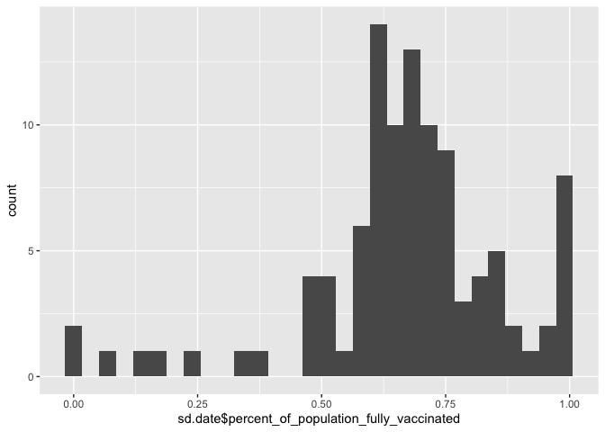
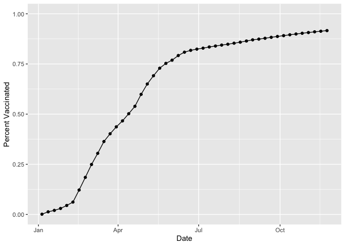
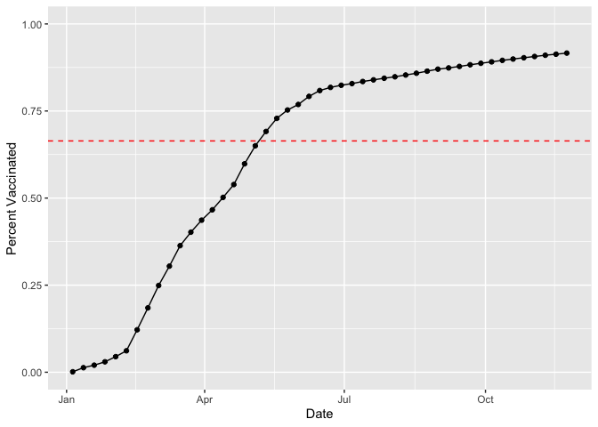
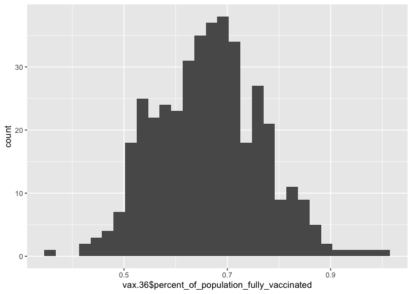
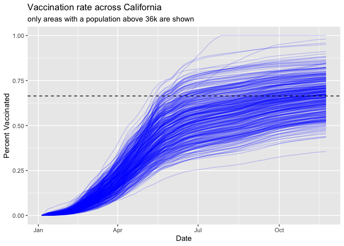

vaccine-mini-project
================
Andrea Sama (A59010582)
11/28/2021

Comparing vaccination rates from around San Diego.

``` r
vax <- read.csv("covid19vaccinesbyzipcode_test.csv")

tail(vax)
```

    ##       as_of_date zip_code_tabulation_area local_health_jurisdiction
    ## 82903 2021-11-23                    94618                   Alameda
    ## 82904 2021-11-23                    94596              Contra Costa
    ## 82905 2021-11-23                    93549                      Inyo
    ## 82906 2021-11-23                    93514                      Inyo
    ## 82907 2021-11-23                    93442           San Luis Obispo
    ## 82908 2021-11-23                    93255                      Kern
    ##                county vaccine_equity_metric_quartile                 vem_source
    ## 82903         Alameda                              4 Healthy Places Index Score
    ## 82904    Contra Costa                              4 Healthy Places Index Score
    ## 82905            Inyo                              2    CDPH-Derived ZCTA Score
    ## 82906            Inyo                              3 Healthy Places Index Score
    ## 82907 San Luis Obispo                              3 Healthy Places Index Score
    ## 82908            Kern                              1    CDPH-Derived ZCTA Score
    ##       age12_plus_population age5_plus_population persons_fully_vaccinated
    ## 82903               14889.3                16370                    13271
    ## 82904               19477.3                20841                    18155
    ## 82905                 290.2                  293                       NA
    ## 82906               12330.9                13456                     7277
    ## 82907               10005.2                10615                     7202
    ## 82908                 683.0                  691                      220
    ##       persons_partially_vaccinated percent_of_population_fully_vaccinated
    ## 82903                         1449                               0.810690
    ## 82904                         1363                               0.871119
    ## 82905                           NA                                     NA
    ## 82906                          969                               0.540800
    ## 82907                          745                               0.678474
    ## 82908                           23                               0.318379
    ##       percent_of_population_partially_vaccinated
    ## 82903                                   0.088516
    ## 82904                                   0.065400
    ## 82905                                         NA
    ## 82906                                   0.072012
    ## 82907                                   0.070184
    ## 82908                                   0.033285
    ##       percent_of_population_with_1_plus_dose
    ## 82903                               0.899206
    ## 82904                               0.936519
    ## 82905                                     NA
    ## 82906                               0.612812
    ## 82907                               0.748658
    ## 82908                               0.351664
    ##                                                                    redacted
    ## 82903                                                                    No
    ## 82904                                                                    No
    ## 82905 Information redacted in accordance with CA state privacy requirements
    ## 82906                                                                    No
    ## 82907                                                                    No
    ## 82908                                                                    No

Question 1: The column “persons_fully_vaccinated” details the number of
people fully vaccinated

Question 2: The column “zip_code_tabulation_area” details the zip code
tabulation area.

Question 3: The earliest date in this data set is January 5th 2021

Question 4: The latest date in this data set is November 23rd 2021/

``` r
#skimr::skim(vax)
```

Q5: There are nine numeric columns in this data set.

Q6: There are 8355 NA values in the persons_fully_vaccinated column.

Q7: The percent of persons_fully_vaccinated that are missing is about
10%

``` r
#install.packages("lubridate")
library(lubridate)
```

    ## 
    ## Attaching package: 'lubridate'

    ## The following objects are masked from 'package:base':
    ## 
    ##     date, intersect, setdiff, union

``` r
today()
```

    ## [1] "2021-12-04"

``` r
# Specify that we are using the year-month-day format
vax$as_of_date <- ymd(vax$as_of_date)
```

``` r
today() - vax$as_of_date[1]
```

    ## Time difference of 333 days

How much time since the first vaccination reported.

``` r
vax$as_of_date[nrow(vax)] - vax$as_of_date[1]
```

    ## Time difference of 322 days

``` r
vax$as_of_date[82908] - vax$as_of_date[1]
```

    ## Time difference of 322 days

``` r
today() - vax$as_of_date[nrow(vax)]
```

    ## Time difference of 11 days

5 days have passed.

``` r
(vax$as_of_date[nrow(vax)]-vax$as_of_date[1])/7
```

    ## Time difference of 46 days

46 unique dates in the dataset.

#Working with ZIP codes

``` r
#install.packages("zipcodeR")
library(zipcodeR)
```

``` r
geocode_zip('92037')
```

    ## # A tibble: 1 × 3
    ##   zipcode   lat   lng
    ##   <chr>   <dbl> <dbl>
    ## 1 92037    32.8 -117.

``` r
zip_distance('92037','92109')
```

    ##   zipcode_a zipcode_b distance
    ## 1     92037     92109     2.33

``` r
reverse_zipcode(c('92037', "92109") )
```

    ## # A tibble: 2 × 24
    ##   zipcode zipcode_type major_city post_office_city common_city_list county state
    ##   <chr>   <chr>        <chr>      <chr>                      <blob> <chr>  <chr>
    ## 1 92037   Standard     La Jolla   La Jolla, CA           <raw 20 B> San D… CA   
    ## 2 92109   Standard     San Diego  San Diego, CA          <raw 21 B> San D… CA   
    ## # … with 17 more variables: lat <dbl>, lng <dbl>, timezone <chr>,
    ## #   radius_in_miles <dbl>, area_code_list <blob>, population <int>,
    ## #   population_density <dbl>, land_area_in_sqmi <dbl>,
    ## #   water_area_in_sqmi <dbl>, housing_units <int>,
    ## #   occupied_housing_units <int>, median_home_value <int>,
    ## #   median_household_income <int>, bounds_west <dbl>, bounds_east <dbl>,
    ## #   bounds_north <dbl>, bounds_south <dbl>

``` r
# Pull data for all ZIP codes in the dataset
zipdata <- reverse_zipcode( vax$zip_code_tabulation_area )
zipdata
```

    ## # A tibble: 1,764 × 24
    ##    zipcode zipcode_type major_city  post_office_city common_city_list county    
    ##    <chr>   <chr>        <chr>       <chr>                      <blob> <chr>     
    ##  1 90001   Standard     Los Angeles Los Angeles, CA        <raw 44 B> Los Angel…
    ##  2 90002   Standard     Los Angeles Los Angeles, CA        <raw 47 B> Los Angel…
    ##  3 90003   Standard     Los Angeles Los Angeles, CA        <raw 23 B> Los Angel…
    ##  4 90004   Standard     Los Angeles Los Angeles, CA        <raw 34 B> Los Angel…
    ##  5 90005   Standard     Los Angeles Los Angeles, CA        <raw 34 B> Los Angel…
    ##  6 90006   Standard     Los Angeles Los Angeles, CA        <raw 23 B> Los Angel…
    ##  7 90007   Standard     Los Angeles Los Angeles, CA        <raw 37 B> Los Angel…
    ##  8 90008   Standard     Los Angeles Los Angeles, CA        <raw 53 B> Los Angel…
    ##  9 90010   Standard     Los Angeles Los Angeles, CA        <raw 23 B> Los Angel…
    ## 10 90011   Standard     Los Angeles Los Angeles, CA        <raw 23 B> Los Angel…
    ## # … with 1,754 more rows, and 18 more variables: state <chr>, lat <dbl>,
    ## #   lng <dbl>, timezone <chr>, radius_in_miles <dbl>, area_code_list <blob>,
    ## #   population <int>, population_density <dbl>, land_area_in_sqmi <dbl>,
    ## #   water_area_in_sqmi <dbl>, housing_units <int>,
    ## #   occupied_housing_units <int>, median_home_value <int>,
    ## #   median_household_income <int>, bounds_west <dbl>, bounds_east <dbl>,
    ## #   bounds_north <dbl>, bounds_south <dbl>

``` r
# Subset to San Diego county only areas
library(dplyr)
```

    ## 
    ## Attaching package: 'dplyr'

    ## The following objects are masked from 'package:stats':
    ## 
    ##     filter, lag

    ## The following objects are masked from 'package:base':
    ## 
    ##     intersect, setdiff, setequal, union

``` r
sd <- filter(vax, county == "San Diego")

nrow(sd)
```

    ## [1] 5029

``` r
unique(sd$zip_code_tabulation_area)
```

    ##   [1] 91901 91902 92011 92055 92067 92081 92134 92124 92058 92132 92147 92135
    ##  [13] 92145 92078 92123 92173 92010 92019 92117 91932 92131 91905 92057 91913
    ##  [25] 91942 91910 92009 92026 92140 92029 92102 92155 92014 92061 91934 91916
    ##  [37] 91914 92082 91950 91935 92083 92113 92104 92103 92075 92084 92066 92060
    ##  [49] 91911 91941 91980 92139 92116 91977 92091 92118 91962 91963 91948 92154
    ##  [61] 91906 92120 91978 92114 92115 92122 91917 92064 92126 91931 92069 92086
    ##  [73] 91945 92130 92027 92071 92070 92037 92106 92024 92109 92021 92105 92127
    ##  [85] 92101 92028 92003 92059 92129 92119 92121 92108 92107 92128 92110 92008
    ##  [97] 92007 91915 92004 92020 92111 92065 92025 92036 92054 92056 92040

``` r
length(unique(sd$zip_code_tabulation_area))
```

    ## [1] 107

There are 107 unique zip codes in San Diego County.

``` r
which.max(sd$age12_plus_population)
```

    ## [1] 60

``` r
sd[60,]
```

    ##    as_of_date zip_code_tabulation_area local_health_jurisdiction    county
    ## 60 2021-01-05                    92154                 San Diego San Diego
    ##    vaccine_equity_metric_quartile                 vem_source
    ## 60                              2 Healthy Places Index Score
    ##    age12_plus_population age5_plus_population persons_fully_vaccinated
    ## 60               76365.2                82971                       33
    ##    persons_partially_vaccinated percent_of_population_fully_vaccinated
    ## 60                         1341                               0.000398
    ##    percent_of_population_partially_vaccinated
    ## 60                                   0.016162
    ##    percent_of_population_with_1_plus_dose redacted
    ## 60                                0.01656       No

The 92154 zip code has the highest age 12+ population.

``` r
library(dplyr)

sd.date <- filter(vax, county == "San Diego", as_of_date == "2021-11-16")

head(sd.date)
```

    ##   as_of_date zip_code_tabulation_area local_health_jurisdiction    county
    ## 1 2021-11-16                    92020                 San Diego San Diego
    ## 2 2021-11-16                    92004                 San Diego San Diego
    ## 3 2021-11-16                    92065                 San Diego San Diego
    ## 4 2021-11-16                    92037                 San Diego San Diego
    ## 5 2021-11-16                    92086                 San Diego San Diego
    ## 6 2021-11-16                    92036                 San Diego San Diego
    ##   vaccine_equity_metric_quartile                 vem_source
    ## 1                              2 Healthy Places Index Score
    ## 2                              2 Healthy Places Index Score
    ## 3                              3 Healthy Places Index Score
    ## 4                              4 Healthy Places Index Score
    ## 5                              1 Healthy Places Index Score
    ## 6                              2 Healthy Places Index Score
    ##   age12_plus_population age5_plus_population persons_fully_vaccinated
    ## 1               49284.5                54991                    35128
    ## 2                2151.8                 2186                     2592
    ## 3               32025.6                35208                    18466
    ## 4               33675.6                36144                    33002
    ## 5                1460.5                 1492                      718
    ## 6                2333.9                 2496                     1848
    ##   persons_partially_vaccinated percent_of_population_fully_vaccinated
    ## 1                         5161                               0.638795
    ## 2                          557                               1.000000
    ## 3                         2536                               0.524483
    ## 4                         7159                               0.913070
    ## 5                          105                               0.481233
    ## 6                          367                               0.740385
    ##   percent_of_population_partially_vaccinated
    ## 1                                   0.093852
    ## 2                                   0.254803
    ## 3                                   0.072029
    ## 4                                   0.198069
    ## 5                                   0.070375
    ## 6                                   0.147035
    ##   percent_of_population_with_1_plus_dose redacted
    ## 1                               0.732647       No
    ## 2                               1.000000       No
    ## 3                               0.596512       No
    ## 4                               1.000000       No
    ## 5                               0.551608       No
    ## 6                               0.887420       No

``` r
mean(sd.date$percent_of_population_fully_vaccinated, na.rm=TRUE)
```

    ## [1] 0.671603

``` r
sd.date.na <-na.omit(sd.date)
head(sd.date.na)
```

    ##   as_of_date zip_code_tabulation_area local_health_jurisdiction    county
    ## 1 2021-11-16                    92020                 San Diego San Diego
    ## 2 2021-11-16                    92004                 San Diego San Diego
    ## 3 2021-11-16                    92065                 San Diego San Diego
    ## 4 2021-11-16                    92037                 San Diego San Diego
    ## 5 2021-11-16                    92086                 San Diego San Diego
    ## 6 2021-11-16                    92036                 San Diego San Diego
    ##   vaccine_equity_metric_quartile                 vem_source
    ## 1                              2 Healthy Places Index Score
    ## 2                              2 Healthy Places Index Score
    ## 3                              3 Healthy Places Index Score
    ## 4                              4 Healthy Places Index Score
    ## 5                              1 Healthy Places Index Score
    ## 6                              2 Healthy Places Index Score
    ##   age12_plus_population age5_plus_population persons_fully_vaccinated
    ## 1               49284.5                54991                    35128
    ## 2                2151.8                 2186                     2592
    ## 3               32025.6                35208                    18466
    ## 4               33675.6                36144                    33002
    ## 5                1460.5                 1492                      718
    ## 6                2333.9                 2496                     1848
    ##   persons_partially_vaccinated percent_of_population_fully_vaccinated
    ## 1                         5161                               0.638795
    ## 2                          557                               1.000000
    ## 3                         2536                               0.524483
    ## 4                         7159                               0.913070
    ## 5                          105                               0.481233
    ## 6                          367                               0.740385
    ##   percent_of_population_partially_vaccinated
    ## 1                                   0.093852
    ## 2                                   0.254803
    ## 3                                   0.072029
    ## 4                                   0.198069
    ## 5                                   0.070375
    ## 6                                   0.147035
    ##   percent_of_population_with_1_plus_dose redacted
    ## 1                               0.732647       No
    ## 2                               1.000000       No
    ## 3                               0.596512       No
    ## 4                               1.000000       No
    ## 5                               0.551608       No
    ## 6                               0.887420       No

``` r
mean(sd.date.na$percent_of_population_fully_vaccinated)
```

    ## [1] 0.6880539

``` r
library(ggplot2)

ggplot(sd.date, aes(sd.date$percent_of_population_fully_vaccinated, )) + geom_histogram()
```

    ## Warning: Use of `sd.date$percent_of_population_fully_vaccinated` is discouraged.
    ## Use `percent_of_population_fully_vaccinated` instead.

    ## `stat_bin()` using `bins = 30`. Pick better value with `binwidth`.

    ## Warning: Removed 3 rows containing non-finite values (stat_bin).

<!-- -->

#Focus on UCSD/La Jolla

``` r
ucsd <- filter(sd, zip_code_tabulation_area=="92037")
ucsd[1,]$age5_plus_population
```

    ## [1] 36144

``` r
ggplot(ucsd) +
  aes(ucsd$as_of_date,
      ucsd$percent_of_population_fully_vaccinated) +
  geom_point() +
  geom_line(group=1) +
  ylim(c(0,1)) +
  labs(x="Date", y="Percent Vaccinated")
```

    ## Warning: Use of `ucsd$as_of_date` is discouraged. Use `as_of_date` instead.

    ## Warning: Use of `ucsd$percent_of_population_fully_vaccinated` is discouraged.
    ## Use `percent_of_population_fully_vaccinated` instead.

    ## Warning: Use of `ucsd$as_of_date` is discouraged. Use `as_of_date` instead.

    ## Warning: Use of `ucsd$percent_of_population_fully_vaccinated` is discouraged.
    ## Use `percent_of_population_fully_vaccinated` instead.

<!-- -->

``` r
# Subset to all CA areas with a population as large as 92037
vax.36 <- filter(vax, age5_plus_population > 36144 &
                as_of_date == "2021-11-16")

head(vax.36)
```

    ##   as_of_date zip_code_tabulation_area local_health_jurisdiction         county
    ## 1 2021-11-16                    92020                 San Diego      San Diego
    ## 2 2021-11-16                    92563                 Riverside      Riverside
    ## 3 2021-11-16                    92806                    Orange         Orange
    ## 4 2021-11-16                    93291                    Tulare         Tulare
    ## 5 2021-11-16                    92335            San Bernardino San Bernardino
    ## 6 2021-11-16                    92618                    Orange         Orange
    ##   vaccine_equity_metric_quartile                 vem_source
    ## 1                              2 Healthy Places Index Score
    ## 2                              3 Healthy Places Index Score
    ## 3                              2 Healthy Places Index Score
    ## 4                              1 Healthy Places Index Score
    ## 5                              1 Healthy Places Index Score
    ## 6                              4 Healthy Places Index Score
    ##   age12_plus_population age5_plus_population persons_fully_vaccinated
    ## 1               49284.5                54991                    35128
    ## 2               55897.8                63794                    36051
    ## 3               33050.9                36739                    24810
    ## 4               46879.7                54254                    27936
    ## 5               79670.3                91867                    49820
    ## 6               40348.0                44304                    39695
    ##   persons_partially_vaccinated percent_of_population_fully_vaccinated
    ## 1                         5161                               0.638795
    ## 2                         4224                               0.565116
    ## 3                         2355                               0.675304
    ## 4                         4012                               0.514911
    ## 5                         5970                               0.542306
    ## 6                         3936                               0.895969
    ##   percent_of_population_partially_vaccinated
    ## 1                                   0.093852
    ## 2                                   0.066213
    ## 3                                   0.064101
    ## 4                                   0.073948
    ## 5                                   0.064985
    ## 6                                   0.088841
    ##   percent_of_population_with_1_plus_dose redacted
    ## 1                               0.732647       No
    ## 2                               0.631329       No
    ## 3                               0.739405       No
    ## 4                               0.588859       No
    ## 5                               0.607291       No
    ## 6                               0.984810       No

``` r
mean(vax.36$percent_of_population_fully_vaccinated)
```

    ## [1] 0.6640413

``` r
ggplot(ucsd) +
  aes(ucsd$as_of_date,
      ucsd$percent_of_population_fully_vaccinated) +
  geom_point() +
  geom_line(group=1) +
  ylim(c(0,1)) +
  labs(x="Date", y="Percent Vaccinated")+
  geom_hline(yintercept=0.6640413, color="red", linetype= "dashed")
```

    ## Warning: Use of `ucsd$as_of_date` is discouraged. Use `as_of_date` instead.

    ## Warning: Use of `ucsd$percent_of_population_fully_vaccinated` is discouraged.
    ## Use `percent_of_population_fully_vaccinated` instead.

    ## Warning: Use of `ucsd$as_of_date` is discouraged. Use `as_of_date` instead.

    ## Warning: Use of `ucsd$percent_of_population_fully_vaccinated` is discouraged.
    ## Use `percent_of_population_fully_vaccinated` instead.

<!-- -->

``` r
fivenum(vax.36$percent_of_population_fully_vaccinated)
```

    ## [1] 0.3528910 0.5905170 0.6661630 0.7297545 1.0000000

``` r
mean(vax.36$percent_of_population_fully_vaccinated)
```

    ## [1] 0.6640413

``` r
ggplot(vax.36) +
  aes(vax.36$percent_of_population_fully_vaccinated) +
  geom_histogram() 
```

    ## Warning: Use of `vax.36$percent_of_population_fully_vaccinated` is discouraged.
    ## Use `percent_of_population_fully_vaccinated` instead.

    ## `stat_bin()` using `bins = 30`. Pick better value with `binwidth`.

<!-- -->

``` r
#vax %>% filter(as_of_date == "2021-11-16") %>%  
  #filter(zip_code_tabulation_area=="92040") %>%
  #select(percent_of_population_fully_vaccinated)
```

Below the average value.

``` r
vax.36.all <- filter(vax, age5_plus_population > 36144)


ggplot(vax.36.all) +
  aes(as_of_date,
      percent_of_population_fully_vaccinated, 
      group=zip_code_tabulation_area) +
  geom_line(alpha=0.2, color="blue") +
  ylim(0, 1.00) +
  labs(x="Date", y="Percent Vaccinated",
       title="Vaccination rate across California",
       subtitle="only areas with a population above 36k are shown") +
  geom_hline(yintercept = 0.6640413, linetype= "dashed")
```

    ## Warning: Removed 176 row(s) containing missing values (geom_path).

<!-- -->

I think I would prefer for next weeks classes to be online, especially
with the Omicron variant surge.
